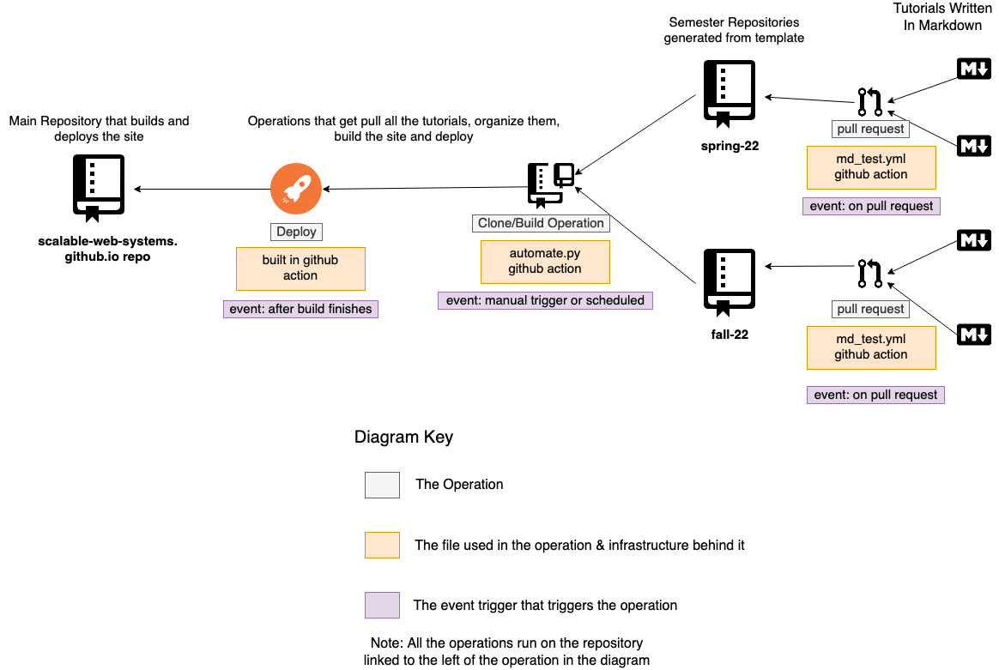

# Scalable Web Systems

This repository hosts the website and the automations to pull all the tutorials and build the site with the relevant github actions. 

The following is an architecture diagram of how the whole automated wiki works. 

